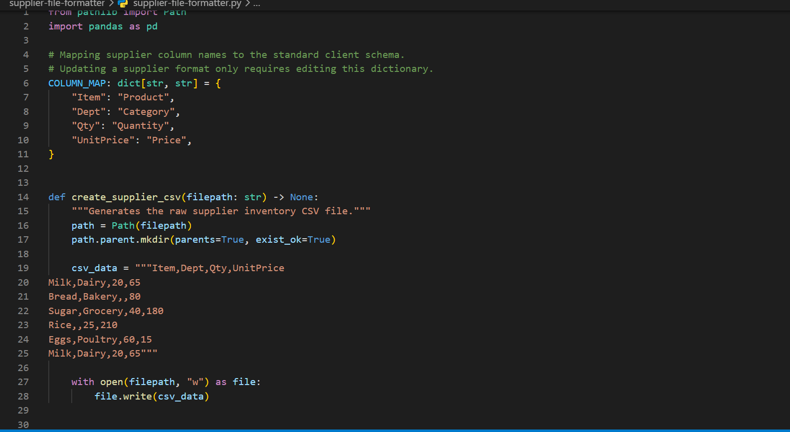
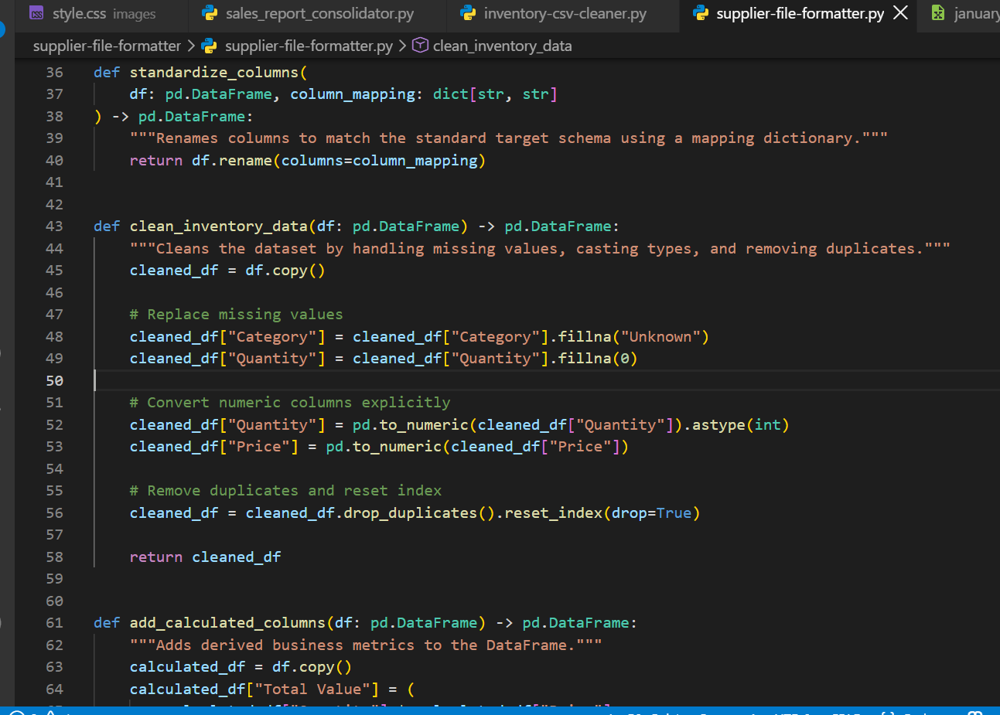
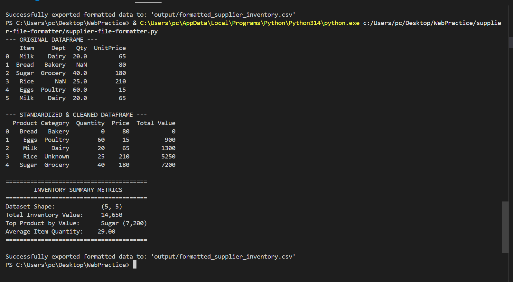

# Supplier File Formatter

A Python automation tool that standardizes supplier inventory files into a consistent business-ready format. It renames supplier-specific columns, cleans missing values, converts numeric data, removes duplicate records, calculates inventory value, sorts the results, and exports a formatted CSV report.

## What This Project Does

Supplier files often arrive with inconsistent column names, missing values, duplicate records, and different data formats.

This project automates the standardization process.

The script:

1. Loads a supplier inventory CSV file.
2. Maps supplier-specific column names to a standard schema.
3. Handles missing categories and quantities.
4. Converts numeric fields to the correct data types.
5. Removes duplicate records.
6. Calculates total inventory value for each product.
7. Sorts the final dataset by product name.
8. Calculates inventory summary statistics.
9. Exports the standardized dataset as a CSV report.

## Technologies Used

* Python
* Pandas
* CSV
* Type hints
* Functions
* Dictionary-based column mapping

## Project Structure

```text
supplier-file-formatter/
│
├── output/
│   └── formatted_supplier_inventory.csv
│
├── sample_data/
│   └── supplier_inventory.csv
│
├── screenshots/
│   ├── 01_code_setup.png
│   ├── 02_processing_reporting.png
│   └── 03_successful_execution.png
│
├── README.md
└── supplier-file-formatter.py
```

## Example Input

The supplier file uses supplier-specific column names:

```csv
Item,Dept,Qty,UnitPrice
Milk,Dairy,20,65
Bread,Bakery,,80
Sugar,Grocery,40,180
Rice,,25,210
Eggs,Poultry,60,15
Milk,Dairy,20,65
```

The dataset intentionally contains:

* Different column names
* A missing quantity
* A missing department
* A duplicate Milk record

## Column Standardization

The script uses a reusable mapping dictionary:

```python
COLUMN_MAP = {
    "Item": "Product",
    "Dept": "Category",
    "Qty": "Quantity",
    "UnitPrice": "Price",
}
```

This allows supplier-specific column names to be converted into a standard business schema without rewriting the processing logic.

## Data Cleaning

The formatter handles several common data-quality problems.

### Missing values

Missing categories are replaced with:

```text
Unknown
```

Missing quantities are replaced with:

```text
0
```

### Data types

Quantity and price values are converted to numeric types so they can be used reliably in calculations.

### Duplicate records

Duplicate inventory records are removed automatically.

## Calculated Business Metric

The script creates a `Total Value` column:

```text
Total Value = Quantity × Price
```

For example:

```text
Sugar
Quantity: 40
Price: 180
Total Value: 7,200
```

## Generated Output

The processed file is saved as:

```text
output/formatted_supplier_inventory.csv
```

Example output:

```csv
Product,Category,Quantity,Price,Total Value
Bread,Bakery,0,80,0
Eggs,Poultry,60,15,900
Milk,Dairy,20,65,1300
Rice,Unknown,25,210,5250
Sugar,Grocery,40,180,7200
```

## Example Summary

For the included sample dataset, the script produces:

```text
Dataset Shape:             (5, 5)
Total Inventory Value:     14,650
Top Product by Value:      Sugar (7,200)
Average Item Quantity:     29.00
```

The original dataset contains six rows, but the duplicate Milk record is removed during processing, producing a final dataset of five rows.

## How to Run

### 1. Clone the repository

```bash
git clone https://github.com/georgesorrowist170-sudo/supplier-file-formatter.git
```

### 2. Install Pandas

```bash
pip install pandas
```

### 3. Run the script

```bash
python supplier-file-formatter.py
```

The formatted report will be generated at:

```text
output/formatted_supplier_inventory.csv
```

## Screenshots

### Code Setup



### Processing and Reporting



### Successful Execution



## Skills Demonstrated

This project demonstrates practical Python automation skills including:

* Functions
* Type hints
* Pandas DataFrames
* CSV processing
* Dictionary-based column mapping
* Data cleaning
* Missing-value handling
* Numeric type conversion
* Duplicate removal
* DataFrame sorting
* Calculated business metrics
* Statistical calculations
* CSV report generation
* File handling
* Modular Python program design

## Business Use Case

This type of automation can be used when businesses receive inventory or supplier files from different sources that use inconsistent formats.

Instead of manually correcting every file, the formatter can standardize the data into a predictable structure that is easier to analyze, store, and process with other business systems.

## Purpose

This project was built as a practical example of automating supplier-file standardization and inventory data preparation using Python and Pandas.


